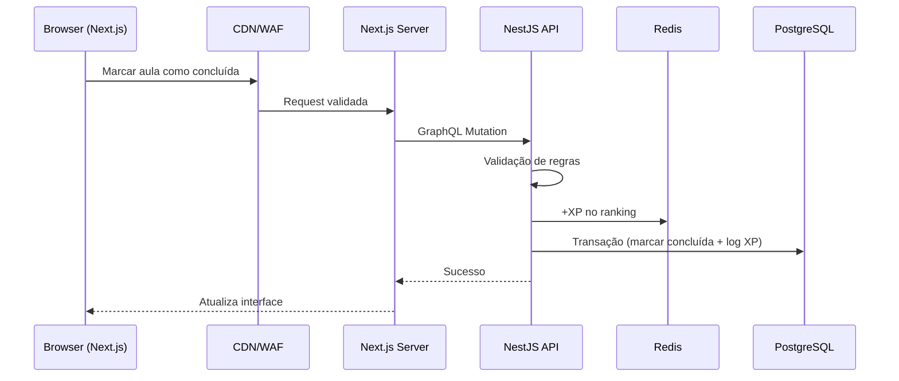

# Arquitetura

Documento técnico descrevendo a arquitetura da plataforma gamificada de ensino de programação.

## Visão Geral

O sistema é uma plataforma de ensino de programação gamificada, projetada com foco em **alta performance**, **observabilidade** e **escalabilidade horizontal**. A arquitetura segue o padrão **Stateless**, permitindo múltiplas instâncias e balanceamento de carga.

## Stack Tecnológica

### Front-end

| Tecnologia | Propósito |
|------------|-----------|
| **Next.js** | Framework React com SSR e RSC |
| **Server Components** | Otimização de performance e SEO |
| **Server Actions** | Proteção de lógica sensível do cliente |
| **GraphQL** | Comunicação flexível com o back-end |

### Back-end

| Tecnologia | Propósito |
|------------|-----------|
| **NestJS** | Framework Node.js/TypeScript |
| **GraphQL API** | Evita over-fetching e under-fetching |
| **Arquitetura Stateless** | Preparado para escala horizontal |

### Camada de Dados

| Tecnologia | Propósito |
|------------|-----------|
| **PostgreSQL** | Banco relacional principal |
| **Prisma ORM** | Tipagem rigorosa e produtividade |
| **Redis** | Cache e rankings em tempo real |

## Decisões Arquiteturais

### PostgreSQL como Banco Principal

Sistemas de ensino gamificados são **altamente relacionais**:

```
Trilhas → Módulos → Aulas → Progresso do Aluno
```

O PostgreSQL garante:
- **Integridade referencial** via Foreign Keys
- **Transações ACID** para consistência (ex: XP só é creditado se a aula for marcada como concluída)

### Redis para Rankings

Utilização de **Sorted Sets** para calcular Leaderboards de XP com complexidade **O(1)**, sem sobrecarregar o banco principal.

## Módulos

### Gerenciamento de Identidade

Autenticação integrada ao Next.js com suporte a login social (GitHub/Google) e controle de sessão atrelado ao banco de dados.

### Observabilidade

SDKs de monitoramento integrados no front-end e back-end para captura de exceções em tempo real, permitindo rastrear a origem exata de erros.

### Armazenamento de Mídia

Imagens de perfil são armazenados em CDN otimizada, com conversão automática para formatos modernos (WebP).

## Fluxo de Dados

Exemplo: **Concluir uma aula**



## Princípios de Qualidade

A arquitetura reflete um **mindset de QA** através de:

- **Tipagem estrita end-to-end**: TypeScript + Prisma + GraphQL
- **Monitoramento proativo**: Captura de exceções em tempo real
- **Autenticação padronizada**: Sessões seguras e auditáveis

---

<div align="center">

**[README](README.md)** · **[Licença](LICENSE)**

</div>
