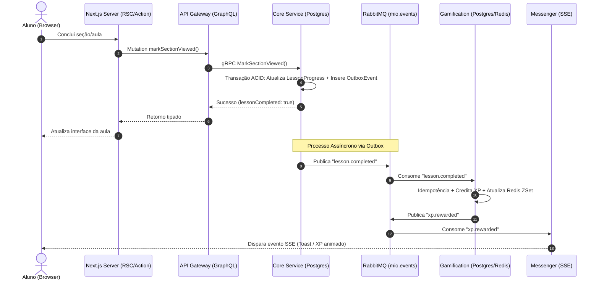

# Arquitetura do Sistema — Mio

Documento técnico descritivo da arquitetura, padrões de projeto e decisões de engenharia da plataforma Mio.

---

## 1. Visão Geral

O **Mio** é uma plataforma gamificada de ensino de programação projetada com foco em **alta performance**, **resiliência**, **desacoplamento de domínios** e **escalabilidade horizontal**.

A solução adota uma **Arquitetura Orientada a Eventos (EDA)** baseada em **microsserviços desacoplados** organizados em um *monorepo*. O sistema separa claramente duas cargas de trabalho com naturezas operacionais distintas:
1. **Carga Transacional e Relacional Estrita (ACID):** Catálogo pedagógico, matrículas, usuários, permissões e registros de progresso.
2. **Carga Analítica e de Baixa Latência em Tempo Real:** Concessão de XP, cálculo de níveis, ofensivas (*streaks*), troféus e rankings globais (*leaderboards*) com complexidade sub-linear.

---

## 2. Stack Tecnológica & Protocolos

### 2.1 Stack Tecnológica

| Camada | Tecnologias | Papel Principal |
| :--- | :--- | :--- |
| **Front-end** | **Next.js 16 (App Router)**, **React 19**, **Tailwind CSS v4**, **GraphQL Codegen** | Renderização *Server-First* (RSC), Server Actions e Design System baseado em *Compound Components*. |
| **BFF / Gateway** | **NestJS**, **Apollo Server (@nestjs/graphql)** | *API Gateway Stateless*, validação de esquemas, RBAC e roteamento síncrono. |
| **Microsserviços** | **NestJS 11**, **Node.js 24**, **TypeScript 5.9 (Strict)** | Serviços de domínio desacoplados com lógica de negócio isolada. |
| **Comunicação Síncrona** | **gRPC**, **HTTP/2**, **Protocol Buffers** | RPC binário de baixa latência e tipagem estrita inter-serviços. |
| **Mensageria / Eventos** | **RabbitMQ 4 (AMQP)** | *Topic Exchange* durável (`mio.events`) para propagação assíncrona de eventos de domínio. |
| **Persistência Relacional** | **PostgreSQL 18**, **Prisma ORM** | Bases de dados relacionais isoladas (*Database-per-Service*) com integridade referencial. |
| **Persistência em Memória** | **Redis 8 (Sorted Sets & Pub/Sub)** | Rankings em tempo real ($O(\log N)$) e sincronização entre nós do Messenger. |
| **Streaming Real-time** | **Server-Sent Events (SSE)** | Túnel HTTP unidirecional para notificações em tempo real no browser. |
| **Monorepo Tooling** | **Turborepo**, **Biome**, **Vitest**, **Docker Compose** | Pipeline de build, lint, formatação ultrarrápida e execução de testes. |

### 2.2 Protocolos de Comunicação

| Conexão | Protocolo | Tipo | Finalidade |
| :--- | :--- | :--- | :--- |
| **Client → Gateway** | **HTTPS / GraphQL** | Síncrono | Consultas e mutações unificadas na borda. |
| **Gateway → Microsserviços** | **gRPC (HTTP/2)** | Síncrono / Binário | Comunicação de altíssima velocidade e baixo overhead. |
| **Microsserviço → Broker** | **AMQP (RabbitMQ)** | Assíncrono | Publicação e consumo desacoplado de eventos de domínio. |
| **Messenger → Client** | **SSE (Server-Sent Events)** | Streaming / Unidirecional | Atualizações instantâneas de XP, ranking e conquistas na tela. |
| **Inter-Instâncias (Messenger)** | **Redis Pub/Sub** | Mensageria em Memória | Distribuição de eventos entre múltiplas réplicas do Messenger. |

---

## 3. Topologia e Componentes

```
┌──────────┐   HTTPS/GraphQL   ┌─────────────┐
│  Client  │ ◄───────────────► │ API Gateway  │
└──────────┘                   └──────┬───────┘
      ▲                               │ gRPC (HTTP/2)
      │ SSE                           ▼
      │                  ┌────────────────────────┐
      │                  │   Core Service (Ensino)│
      │                  │  PostgreSQL (ACID/Outbox)
      │                  └───────────┬────────────┘
      │                              │ PUB lesson.completed
      │                              ▼
      │                     ┌─────────────────┐
      │                     │    RabbitMQ      │
      │                     │  (Topic Exchange)│
      │                     └───┬────┬────┬───┘
      │                         │    │    │
      │            SUB          │    │    │  SUB
      │        lesson.completed │    │    │  lesson.completed
      │                         ▼    │    │  xp.rewarded
      │           ┌──────────────┐   │    ▼
      │           │ Gamificação  │   │  ┌──────────────┐
      │           │(Postgres/ZSet│   │  │  Conquistas  │
      │           └──────┬───────┘   │  │(Achievements)│
      │                  │           │  └──────┬───────┘
      │       PUB xp.rewarded       │   PUB achievement.unlocked
      │                  │           │         │
      │                  ▼           ▼         ▼
      │            ┌──────────────────────────────┐
      │            │        RabbitMQ (volta)       │
      │            └──────┬──────────────┬────────┘
      │                   │              │
      │                   ▼              ▼
      │         ┌──────────────┐  ┌─────────────────┐
      │         │  Messenger   │  │  Notifications    │
      │         │ (SSE / Real) │  │  (Email & Jobs)  │
      └─────────┴──────────────┘  └─────────────────┘
```

### 3.1 API Gateway (BFF - Backend for Frontend)
- **Papel:** Ponto de entrada unificado para a aplicação web. É estritamente **stateless** (sem banco de dados próprio).
- **Responsabilidades:** Autenticação (emissão e verificação de JWT), autorização baseada em papéis ([`RolesGuard`](apps/api/apps/gateway/src/modules/auth/guards/roles.guard.ts)), orquestração de queries/mutações GraphQL e repasse via clientes gRPC.
- **Segurança de Borda:** Utiliza o [`InternalSecretGuard`](apps/api/apps/gateway/src/common/guards/internal-secret.guard.ts) para validar o cabeçalho `x-internal-secret`, garantindo que apenas o servidor Next.js possa invocar o Gateway diretamente.

### 3.2 Serviço Core (Catálogo e Ensino)
- **Banco de Dados:** PostgreSQL (`apps/api/apps/core/prisma/schema.prisma`).
- **Responsabilidades:** Gestão de usuários, papéis (`STUDENT`, `TEACHER`, `ADMIN`), categorias, trilhas, lições, seções em Markdown e controle de progresso do aluno.
- **Transações ACID:** Garante que o progresso só seja registrado atomicamente com a gravação na tabela `OutboxEvent`.

### 3.3 Serviço de Gamificação (XP e Leaderboards)
- **Banco de Dados:** Híbrido — PostgreSQL (auditoria e transações de XP) + Redis Sorted Sets (ranking global).
- **Responsabilidades:** Consome o evento `lesson.completed`, aplica regras dinâmicas de pontuação com **idempotência**, atualiza ofensivas (*streaks*) e publica `xp.rewarded`.

### 3.4 Serviço de Conquistas (Achievements)
- **Banco de Dados:** PostgreSQL (`apps/api/apps/achievements/prisma/schema.prisma`).
- **Responsabilidades:** Avalia regras de desbloqueio de medalhas e troféus ao consumir eventos `lesson.completed` e `xp.rewarded`. Ao atingir a meta, emite `achievement.unlocked`.

### 3.5 Serviço Messenger (Tempo Real)
- **Tecnologia:** Server-Sent Events (SSE) + Redis Pub/Sub.
- **Responsabilidades:** Mantém túneis de conexão unidirecionais com os clientes conectados para despachar notificações visuais imediatas (ganho de XP, subida de nível, medalhas) sem requisições de *polling*.

### 3.6 Serviço de Notificações (Jobs e Comunicação Externa)
- **Tecnologia:** Redis (BullMQ).
- **Responsabilidades:** Processamento em segundo plano de e-mails transacionais (boas-vindas, recuperação de senha) e rotinas agendadas de engajamento, isolando o restante da aplicação de lentidões em provedores externos.

### 3.7 Aplicação Web Frontend (Modular DDD)
- **Tecnologia:** Next.js 16 (App Router), React 19, Tailwind CSS v4.
- **Padrão Arquitetural:** Vertical Slices / Modular DDD (`apps/web/src/modules/<dominio>`) e camada compartilhada (`apps/web/src/shared`).
- **Thin Routing Layer:** `apps/web/src/app` atua estritamente como roteamento fino que delega para `views` de módulos, sem componentes de rota (`_components`).
- **Encapsulamento Estrito:** Apenas o arquivo `index.ts` reside na raiz do módulo; componentes internos de domínio são 100% privados a suas `views`. Componentes transversais reutilizados residem no Design System compartilhado (`shared/components`).

---

## 4. Padrões de Projeto e Decisões de Arquitetura

### 4.1 Monorepo Estruturado e Compartilhamento de Contratos
Todo o código reside em um único repositório gerenciado pelo Turborepo, permitindo pipelines unificados de testes, builds em cache e tipagem estrita compartilhada:
- [`packages/grpc-contracts`](packages/grpc-contracts): Centraliza os contratos `.proto` e descritores `GrpcContract` tipados compartilhados entre servidor (Core/Gamification) e cliente (Gateway).
- [`packages/graphql-schema`](packages/graphql-schema): Mantém o snapshot SDL gerado pelo Gateway, consumido pelo GraphQL Code Generator do frontend para criar tipos TypeScript automaticamente.

### 4.2 Transactional Outbox Pattern
Para solucionar o problema da **Dupla Escrita (*Dual-Write*)** sem a complexidade e os bloqueios de transações distribuídas (2PC):
1. Quando uma operação crítica ocorre no Core (ex: conclusão de lição), a alteração de estado e a criação do evento de domínio são salvas na mesma transação no PostgreSQL (`LessonProgress` + `OutboxEvent`).
2. O [`OutboxPublisherService`](apps/api/libs/events/src/outbox-publisher.service.ts) faz uma reivindicação condicional atômica dos registros (`publishedAt = 1970-01-01`), evitando duplicidade entre réplicas.
3. O evento é despachado para a *Topic Exchange* `mio.events` no RabbitMQ com confirmações (*publisher confirms*).
4. Após o ACK do broker, o evento é marcado com `publishedAt = now()`. Se o envio falhar repetidamente (máximo de 5 tentativas), a mensagem entra em estado de alerta (*Dead-Letter*).

### 4.3 Redis Sorted Sets com *Score Packing* para Rankings Globais
Consultas de classificação e ranking em tabelas relacionais com `ORDER BY` e joins geram severo gargalo de CPU e I/O sob alta carga. O Mio resolve isso com **Redis Sorted Sets (`ZADD`, `ZREVRANK`, `ZREVRANGE`)**:
- **Fórmula de Score Packing (Desempate Temporal Nativo):**
  $$\text{Score} = \text{totalXp} + \left(1 - \frac{\text{timestamp}}{10^{13}}\right)$$
- A pontuação inteira armazena o XP total acumulado, enquanto a parte decimal embute o inverso do timestamp de conclusão.
- Quem atinge a pontuação primeiro assume a posição superior imediatamente, com complexidade assintótica $O(\log N)$ e leituras paginadas em sub-milissegundos.

### 4.4 Isolamento de Dados: Database-per-Service
Cada microsserviço detém autoridade exclusiva sobre suas tabelas. Nenhum microsserviço lê ou escreve diretamente no banco de outro serviço. Quando o serviço de Gamificação precisa exibir nomes e avatares no Leaderboard, ele invoca a RPC `BatchGetUsers` no Core via gRPC, eliminando consultas N+1 e mantendo o encapsulamento de dados.

### 4.5 Segurança em Três Camadas (Defesa em Profundidade)
1. **Camada 1 (Borda/Frontend):** `proxy.ts` e NextAuth interceptam acessos não autorizados a rotas restritas.
2. **Camada 2 (Gateway):** `RolesGuard` valida claims do JWT (`STUDENT`, `TEACHER`, `ADMIN`) para operações administrativas e mutações.
3. **Camada 3 (Core Business Logic):** Validação estrita de posse (`creatorId == currentUserId`) no banco para professores manipulando trilhas e aulas.

---

## 5. Fluxo de Dados Ponta a Ponta

Exemplo: **Conclusão de uma aula e atualização em tempo real**


```mermaid
sequenceDiagram
    autonumber
    actor Aluno as Aluno (Browser)
    participant Web as Next.js Server (RSC/Action)
    participant GW as API Gateway (GraphQL)
    participant Core as Core Service (Postgres)
    participant RMQ as RabbitMQ (mio.events)
    participant Gamif as Gamification (Postgres/Redis)
    participant Msg as Messenger (SSE)

    Aluno->>Web: Conclui seção/aula
    Web->>GW: Mutation markSectionViewed()
    GW->>Core: gRPC MarkSectionViewed()
    Core->>Core: Transação ACID: Atualiza LessonProgress + Insere OutboxEvent
    Core-->>GW: Sucesso (lessonCompleted: true)
    GW-->>Web: Retorno tipado
    Web-->>Aluno: Atualiza interface da aula

    Note over Core,RMQ: Processo Assíncrono via Outbox
    Core->>RMQ: Publica "lesson.completed"
    RMQ->>Gamif: Consome "lesson.completed"
    Gamif->>Gamif: Idempotência + Credita XP + Atualiza Redis ZSet
    Gamif->>RMQ: Publica "xp.rewarded"
    RMQ->>Msg: Consome "xp.rewarded"
    Msg-->>Aluno: Dispara evento SSE (Toast / XP animado)
```

---

## 6. Princípios de Qualidade

- **Tipagem Estrita End-to-End:** TypeScript strict em todo o monorepo, contratos binários Protobuf via gRPC, esquemas Prisma tipados e geração automática de operações no Web via GraphQL Codegen.
- **Idempotência de Processamento:** Consumidores de eventos utilizam restrições de chave composta no banco (ex.: `@@unique([userCode, sourceId])`) para garantir que reentregas de mensagens no RabbitMQ não gerem duplicações de XP ou conquistas.
- **Resiliência e Tolerância a Falhas:** Falhas em serviços de gamificação, e-mail ou streaming não interrompem a navegação e conclusão de conteúdos no Core (*Consistência Eventual*).
- **Saúde e Observabilidade:** Endpoints `/health/live` e `/health/ready` cobrindo conexões gRPC, PostgreSQL, Redis e RabbitMQ.

---

## 7. Referências e Links do Projeto

- **Diagrama de Arquitetura Interativo:** [IcePanel](https://s.icepanel.io/jMRAJCwP216mDS/ov0Y)
- **Documentação do Backend:** [`apps/api/docs/ARCHITECTURE.md`](apps/api/docs/ARCHITECTURE.md)
- **Documentação do Frontend:** [`apps/web/docs/ARCHITECTURE.md`](apps/web/docs/ARCHITECTURE.md)
- **Especificações Funcionais:** [`specs/README.md`](specs/README.md)

<div align="center">

**[README](README.md)** · **[Licença](LICENSE)**

</div>
