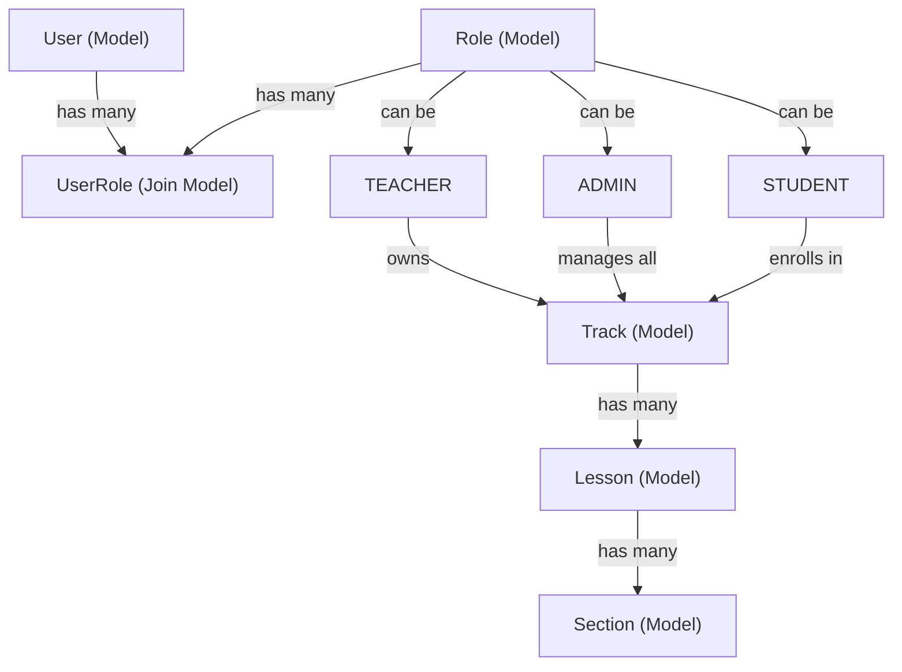
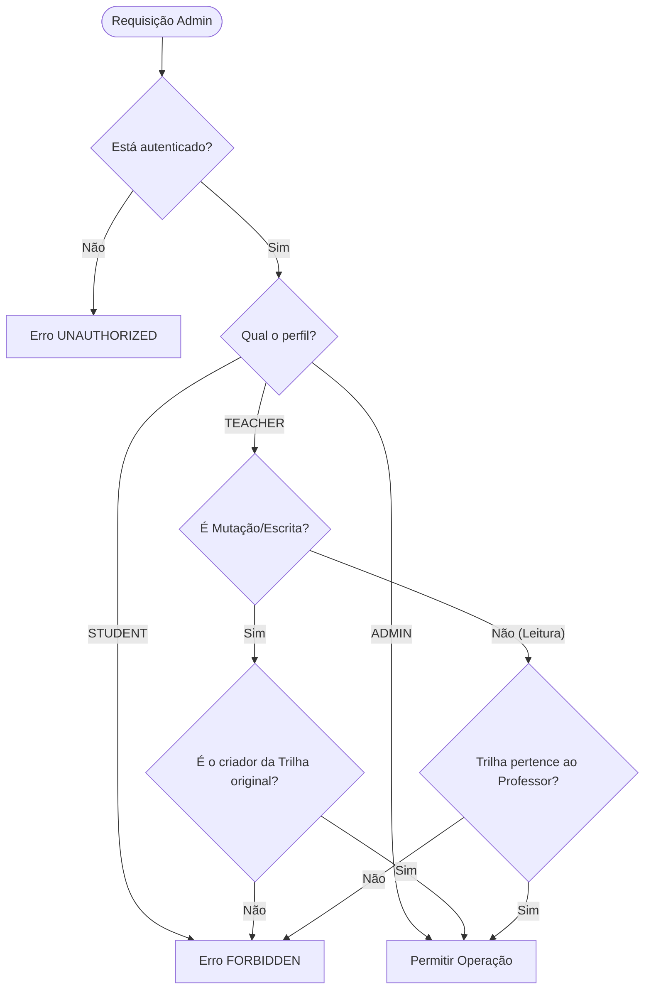

# 09 — Admin & Conteúdo (Multi-Role & Controle de Acesso)

Perfil administrativo expandido para suportar múltiplos níveis de acesso (Aluno comum, Professor e Admin). O objetivo é garantir que professores possam criar e gerenciar suas próprias aulas e trilhas sem ter acesso ou poder modificar as aulas criadas por outros professores, enquanto o administrador global gerencia todo o sistema.

> [!IMPORTANT]
> **Premissa central de conteúdo**: a experiência de edição é de escrita livre ("como um md") salva no banco (`Section.contentMarkdown`), nunca como arquivo. Markdown é o formato de edição/renderização; Postgres é o armazenamento. Isso garante flexibilidade ao autor e facilidade de deploy.

---

## Estrutura de Perfis (Roles)

Definimos três perfis de usuário distintos na plataforma:

| Perfil | Identificador da Role | Permissões | Visibilidade no Admin | Atribuição |
| :--- | :--- | :--- | :--- | :--- |
| **Aluno** | `STUDENT` | Apenas leitura de trilhas publicadas, marcação de progresso e engajamento. | Bloqueado (`FORBIDDEN`). | Padrão no cadastro. |
| **Professor** | `TEACHER` | CRUD completo apenas sobre os conteúdos (Trilhas, Lições e Seções) que **ele mesmo criou**. | Vê apenas suas próprias trilhas e conteúdos no painel. | Manual (Aprovação por Admin). |
| **Administrador** | `ADMIN` | CRUD completo de qualquer conteúdo no sistema, gerenciamento de usuários e alteração de proprietários. | Vê e edita todas as trilhas e conteúdos de todos os professores. | Manual (Apenas via banco/seeding ou por outro Admin). |

> [!NOTE]
> Todo novo usuário registrado é associado à role `STUDENT` por padrão. O acesso de criação de conteúdo só é liberado para o usuário após um `ADMIN` associá-lo à role `TEACHER`.

---

## Modelo de Propriedade & Dados

Para viabilizar que professores não modifiquem ou acessem os conteúdos uns dos outros, introduzimos o conceito de **proprietário da trilha** (`creatorId`). Lições e seções pertencem a uma trilha e, portanto, herdam implicitamente o proprietário da trilha pai.



### Alterações no Prisma Schema

Para suportar múltiplos perfis de forma escalável e segura, utilizaremos tabelas separadas para `Role` e `UserRole` (relação Many-to-Many). As mudanças necessárias em [schema.prisma](../../apps/api/apps/core/prisma/schema.prisma) são:

```prisma
model User {
  id            BigInt     @id @default(autoincrement())
  // ... campos existentes ...
  roles         UserRole[]

  createdTracks Track[]    @relation("TrackCreator")
  // ... relações existentes ...
}

model Role {
  id        BigInt     @id @default(autoincrement())
  name      String     @unique // "STUDENT", "TEACHER", "ADMIN"
  createdAt DateTime   @default(now())
  
  users     UserRole[]
}

model UserRole {
  userId    BigInt
  roleId    BigInt
  createdAt DateTime   @default(now())

  user      User       @relation(fields: [userId], references: [id], onDelete: Cascade)
  role      Role       @relation(fields: [roleId], references: [id], onDelete: Cascade)

  @@id([userId, roleId])
  @@index([userId])
  @@index([roleId])
}

model Track {
  id          BigInt   @id @default(autoincrement())
  slug        String   @unique
  title       String
  description String?
  creatorId   BigInt
  createdAt   DateTime @default(now())
  updatedAt   DateTime @updatedAt

  creator     User     @relation("TrackCreator", fields: [creatorId], references: [id], onDelete: Cascade)
  lessons     Lesson[]
  enrollments Enrollment[]

  @@index([creatorId])
}
```

---

## Fluxo de Autorização e Regras de Negócio

Sempre que uma operação administrativa (leitura ou mutação) for requisitada, o Gateway e o Core devem validar o acesso conforme o fluxo abaixo:



### Detalhamento das Regras de Negócio (CRUD)

1. **Criação de Trilhas**:
   - Tanto `TEACHER` quanto `ADMIN` podem criar trilhas.
   - O campo `creatorId` é preenchido automaticamente com o ID do usuário logado.
2. **Edição e Deleção de Trilhas**:
   - `TEACHER` só pode editar/deletar se `track.creatorId === currentUserId`.
   - `ADMIN` pode editar/deletar qualquer trilha.
3. **Gerenciamento de Lições e Seções**:
   - `TEACHER` só pode adicionar/editar/deletar lições e seções se a trilha pai for de sua autoria.
   - Exemplo: Ao tentar fazer `UpsertLesson` na trilha `backend-node`, o backend buscará se `track.creatorId === currentUserId`.
4. **Gerenciamento de Usuários (Aprovação de Professores)**:
   - Apenas `ADMIN` pode alterar a role de um usuário.

---

## Práticas de Segurança (Hardening)

Para proteger as rotas administrativas e operações de escrita, adotamos as seguintes práticas de segurança integradas à arquitetura do projeto:

### 1. Defesa em Profundidade (Layered Validation)
Qualquer requisição passa por 3 níveis de validação:
- **NextJS Middleware (`apps/web`)**: Intercepta acessos de rota sob `/admin/*`. Redireciona usuários sem claims de `TEACHER` ou `ADMIN` para `/home`.
- **Gateway GraphQL (`apps/api/apps/gateway`)**: Protege as mutations e queries usando `RolesGuard([TEACHER, ADMIN])`. Qualquer chamada de API direta é bloqueada com erro `FORBIDDEN` se não contiver as claims necessárias no JWT.
- **Core Database Logic (`apps/api/apps/core`)**: O Core valida se o `requestor_code` realmente possui o recurso (verifica `creatorId` da trilha original para usuários do tipo `TEACHER`).

### 2. Hardening de Sessão e Tokens (JWT)
- **Tempo de Vida (TTL)**: Os JWTs gerados pelo Gateway devem expirar em no máximo **15 minutos**.
- **Cookies de Sessão**: Cookies criados pelo NextAuth devem ter os atributos de segurança ativos: `HttpOnly: true`, `Secure: true` (em produção) e `SameSite: "Lax"`.
- **Prevenção de Autopromoção**: Nenhum fluxo de cadastro atribui roles de professor automaticamente. Os cadastros criam usuários como `STUDENT` por padrão.

### 3. Planejamento Futuro (Fora de Escopo do MVP)
As seguintes práticas são recomendadas para implementação em fases avançadas de segurança:
- **Autenticação Multifator (MFA/2FA)**: Obrigatoriedade de TOTP para usuários logados sob os perfis `TEACHER` e `ADMIN`.
- **Sistema de Logs de Auditoria**: Escrita imutável de logs de alteração estruturados para monitoramento.

---

## Contratos da API

### gRPC (`packages/grpc-contracts/src/catalog/catalog-admin.proto`)

Criaremos um novo arquivo de contrato específico para as ações administrativas, reduzindo a sobrecarga no catálogo de estudantes.

```proto
syntax = "proto3";

package mio.catalog.admin.v1;

service CatalogAdminService {
  // Trilhas (Tracks)
  rpc ListAdminTracks(ListAdminTracksRequest) returns (AdminTracksResponse);
  rpc GetAdminTrack(GetAdminTrackRequest) returns (AdminTrackDetailResponse);
  rpc CreateTrack(CreateTrackRequest) returns (AdminTrackResponse);
  rpc UpdateTrack(UpdateTrackRequest) returns (AdminTrackResponse);
  rpc DeleteTrack(DeleteTrackRequest) returns (DeleteResponse);

  // Lições (Lessons)
  rpc UpsertLesson(UpsertLessonRequest) returns (AdminLessonResponse);
  rpc DeleteLesson(DeleteLessonRequest) returns (DeleteResponse);

  // Seções (Sections)
  rpc UpsertSection(UpsertSectionRequest) returns (AdminSectionResponse);
  rpc DeleteSection(DeleteSectionRequest) returns (DeleteResponse);
}

message ListAdminTracksRequest {
  string requestor_code = 1;
  string requestor_role = 2; // "TEACHER" | "ADMIN"
}

message GetAdminTrackRequest {
  string slug = 1;
  string requestor_code = 2;
  string requestor_role = 3;
}

message AdminTrackResponse {
  string slug = 1;
  string title = 2;
  string description = 3;
  string creator_code = 4;
}

message AdminTracksResponse {
  repeated AdminTrackResponse tracks = 1;
}

message AdminTrackDetailResponse {
  string slug = 1;
  string title = 2;
  string description = 3;
  string creator_code = 4;
  repeated AdminLessonSummary lessons = 5;
}

message AdminLessonSummary {
  string slug = 1;
  string title = 2;
  int32 position = 3;
}

message CreateTrackRequest {
  string title = 1;
  string description = 2;
  string requestor_code = 3;
}

message UpdateTrackRequest {
  string current_slug = 1;
  string title = 2;
  string description = 3;
  string requestor_code = 4;
  string requestor_role = 5;
}

message DeleteTrackRequest {
  string slug = 1;
  string requestor_code = 2;
  string requestor_role = 3;
}

// ... mensagens de Lessons e Sections contendo context de requestor para autorização ...

message UpsertLessonRequest {
  string track_slug = 1;
  string slug = 2;
  string title = 3;
  int32 position = 4;
  string requestor_code = 5;
  string requestor_role = 6;
}

message DeleteLessonRequest {
  string track_slug = 1;
  string lesson_slug = 2;
  string requestor_code = 3;
  string requestor_role = 4;
}

message UpsertSectionRequest {
  string track_slug = 1;
  string lesson_slug = 2;
  string slug = 3;
  string title = 4;
  int32 position = 5;
  string kind = 6; // "TEXT" | "EXERCISE"
  string content_markdown = 7;
  string requestor_code = 8;
  string requestor_role = 9;
}

message DeleteSectionRequest {
  string track_slug = 1;
  string lesson_slug = 2;
  string section_slug = 3;
  string requestor_code = 4;
  string requestor_role = 5;
}

message DeleteResponse {
  bool success = 1;
}
```

### GraphQL (Gateway Mutations & Queries)

Definido no Code-First do gateway. Expõe as seguintes mutações protegidas por perfis específicos:

```graphql
extend type Query {
  adminTracks: [AdminTrack!]! @auth(roles: [TEACHER, ADMIN])
  adminTrack(slug: ID!): AdminTrackDetail @auth(roles: [TEACHER, ADMIN])
  
  # Apenas Admin
  adminPendingTeachers: [User!]! @auth(roles: [ADMIN])
}

extend type Mutation {
  # Apenas Professor e Admin
  createTrack(input: CreateTrackInput!): AdminTrack! @auth(roles: [TEACHER, ADMIN])
  updateTrack(slug: ID!, input: UpdateTrackInput!): AdminTrack! @auth(roles: [TEACHER, ADMIN])
  deleteTrack(slug: ID!): Boolean! @auth(roles: [TEACHER, ADMIN])

  upsertLesson(input: UpsertLessonInput!): AdminLessonDetail! @auth(roles: [TEACHER, ADMIN])
  deleteLesson(trackSlug: ID!, lessonSlug: ID!): Boolean! @auth(roles: [TEACHER, ADMIN])

  upsertSection(input: UpsertSectionInput!): AdminSectionDetail! @auth(roles: [TEACHER, ADMIN])
  deleteSection(trackSlug: ID!, lessonSlug: ID!, sectionSlug: ID!): Boolean! @auth(roles: [TEACHER, ADMIN])

  # Apenas Admin
  transferTrackOwnership(trackSlug: ID!, targetUserCode: ID!): AdminTrack! @auth(roles: [ADMIN])
  updateUserRole(userCode: ID!, role: UserRole!): User! @auth(roles: [ADMIN])
}
```

---

## Rotas do Frontend (`apps/web`)

Toda a área de administração deve ficar sob `/admin` e utilizar um layout específico com controle estrito de sessão do NextAuth.

### Rotas e Telas a Implementar:

1. `/admin` (Dashboard):
   - Redireciona de acordo com o perfil:
     - `STUDENT`: Redireciona para `/home` com mensagem de erro.
     - `TEACHER`: Visão geral das suas trilhas criadas, métricas básicas de alunos matriculados e botão de criar trilha.
     - `ADMIN`: Visão geral de todas as trilhas do sistema, lista de professores cadastrados e atalhos rápidos.
2. `/admin/users` (Apenas para `ADMIN`):
   - Tela de gestão de usuários. Permite listar os alunos e alterar suas roles para `TEACHER` ou rebaixar se necessário.
3. `/admin/tracks`:
   - Listagem em tabela ou cards das trilhas.
   - Filtro de busca por nome.
   - Professor vê apenas as suas; Admin vê tudo com coluna extra indicando o "Autor/Professor".
4. `/admin/tracks/new`:
   - Formulário simples: Título, Slug (gerado automaticamente) e Descrição.
5. `/admin/tracks/[slug]`:
   - Painel da trilha. Exibe detalhes e árvore de Lições e Seções.
   - Funcionalidade de reordenar lições e seções por drag-and-drop.
6. `/admin/tracks/[slug]/lessons/[lessonSlug]/sections/[sectionSlug]/edit`:
   - Editor de escrita livre em duas colunas:
     - **Coluna Esquerda**: Editor markdown nativo (Textarea aprimorada com atalhos de escrita).
     - **Coluna Direita**: Renderização em tempo real (Preview) usando o mesmo componente do Aluno para fidelidade visual absoluta.

---

## Plano de Execução & Tarefas

### Fase 1: Banco de Dados & Autenticação
- [x] Criar migration para adicionar tabelas `Role` e `UserRole` e estabelecer relações no [schema.prisma](../../apps/api/apps/core/prisma/schema.prisma).
- [x] Adicionar coluna `creatorId` e índice em `Track` no [schema.prisma](../../apps/api/apps/core/prisma/schema.prisma).
- [x] Atualizar o token JWT no NextAuth para propagar as `roles` do usuário.
- [x] Implementar a lógica de propagação das `roles` na query GraphQL `me`.

### Fase 2: gRPC & Core Business Logic
- [ ] Criar o arquivo de contrato [catalog-admin.proto](../../packages/grpc-contracts/src/catalog/catalog-admin.proto).
- [ ] Gerar as tipagens de gRPC para o novo contrato e registrar o client.
- [ ] Implementar o `CatalogAdminController` e `CatalogAdminService` no Core.
- [ ] Escrever validações de propriedade: verificar se `creatorId` da trilha é igual ao do requisitante antes de qualquer operação de escrita ou leitura administrativa se o requisitante for `TEACHER`.
- [x] Implementar endpoint gRPC no `UsersService` para permitir que o ADMIN altere o papel de um usuário e liste/busque usuários.

### Fase 3: Gateway & GraphQL
- [x] Criar o `RolesGuard` no Gateway para extrair e validar o perfil a partir do JWT decodificado.
- [x] Implementar resolvers GraphQL para as novas mutations e queries descritas no contrato.
- [x] Vincular as chamadas do Gateway ao cliente gRPC `UsersService` do Core.

### Fase 4: Frontend & UI
- [ ] Criar Middleware do NextJS para bloquear acessos a `/admin` de usuários que não sejam `TEACHER` ou `ADMIN`.
- [x] Construir layout administrativo e barra de navegação (sidebar dinâmica baseada em perfil).
- [x] Implementar tela `/admin` (Painel Geral) para gerenciamento de permissões (Apenas para `ADMIN`).
- [ ] Implementar listagem de trilhas e telas de edição.
- [ ] Implementar o editor de markdown com split screen (Preview).

---

## Critérios de Aceite

1. **Segurança de Acesso**:
   - Um usuário com papel `STUDENT` tentando acessar `/admin` na web é redirecionado para `/home`.
   - Um usuário com papel `STUDENT` tentando realizar chamadas nas mutations de admin via GraphQL recebe um erro `FORBIDDEN`.
2. **Atribuição Manual de Professor**:
   - Novo usuário cadastrado possui a role `STUDENT` por padrão e não tem acesso administrativo.
   - O `ADMIN` promove o usuário para `TEACHER` através da mutation `updateUserRole`.
   - O usuário recém-promovido passa a conseguir acessar o painel `/admin` após a atualização de sua sessão.
3. **Isolamento de Professores**:
   - O Professor A cria a trilha "NestJS Pro". Ele consegue visualizá-la no painel `/admin/tracks` e editá-la.
   - O Professor B loga no sistema. Ele **não visualiza** a trilha "NestJS Pro" em seu `/admin/tracks`.
   - Se o Professor B tentar disparar a mutation `updateTrack(slug: "nestjs-pro", ...)` diretamente, o backend deve barrar a requisição e retornar `FORBIDDEN`.
4. **Visibilidade Total do Admin**:
   - O Admin loga no sistema. Ele visualiza as trilhas do Professor A, Professor B e qualquer outra.
   - O Admin pode editar ou deletar qualquer uma das trilhas de qualquer professor.
5. **Resiliência do Banco**:
   - Se um Professor for removido do banco de dados, suas trilhas criadas mantêm-se intactas com `creatorId = NULL` (para evitar deleção em cascata e perda de progresso de alunos matriculados).

